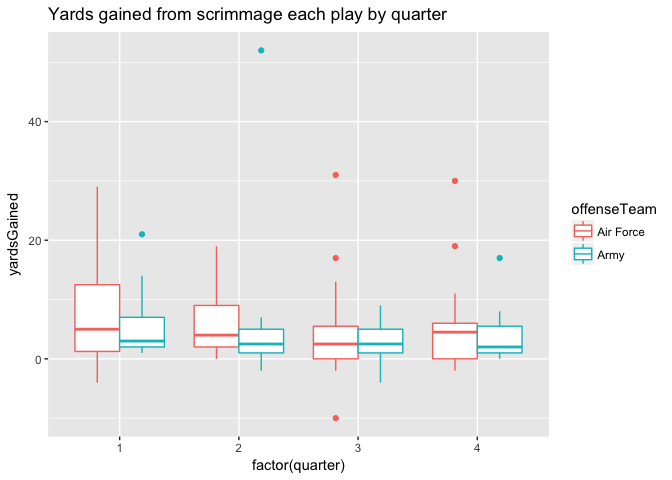

Army vs. Air Force 2018 - Can we predict the number of yards Army gained each play on offense?
==============================================================================================

This code performs analysis of play-by-play data from the Army - Air Force 2018 football game. Intended to demonstrate regression models in introductory statistics courses.

The file "PBP - 2018 - Week 10.csv" contains play-by-play data for every college football game up to Week 10. The data is available from user BlueSCar at <https://www.reddit.com/r/CFBAnalysis/comments/6wz5ww/2017_play_by_play_data/>.

Load libraries and data
-----------------------

``` r
library(tidyverse)
plays <- read_csv(file = "PBP - 2018 - Week 10.csv")
View(plays)
```

Data Cleaning
-------------

``` r
# First, we will filter out other games.
plays <- plays %>% filter(homeTeam == "Army")

# Next, filter out punts, kickoffs, penalties, etc. 
unique(plays$type)
```

    ##  [1] "Kickoff"                  "Rush"                    
    ##  [3] "Penalty"                  "Pass Reception"          
    ##  [5] "Rushing Touchdown"        "End Period"              
    ##  [7] "Pass Incompletion"        "Punt"                    
    ##  [9] "Timeout"                  "Pass Interception Return"
    ## [11] "End of Half"              "Field Goal Good"

``` r
plays_RushAndPass <- plays %>% 
  filter(type %in% c("Rush","Pass Reception",
                     "Rushing Touchdown",
                     "Pass Incompletion")) 
```

Data Analysis
-------------

``` r
#Yards by quarter
plays_RushAndPass %>% 
  ggplot(aes(x = factor(quarter), y = yardsGained, color = offenseTeam)) +
  geom_boxplot() + ggtitle("Yards gained by quarter")
```



``` r
#Yards by down
plays_RushAndPass %>% ggplot(aes(x = factor(down), y = yardsGained, color = offenseTeam)) +
  geom_boxplot() + ggtitle("Yards gained by down")
```


``` r
plays_RushAndPass %>% group_by(quarter, offenseTeam) %>% 
  summarise(averageYards = mean(yardsGained),
            totalYards = sum(yardsGained), 
            n = n())
```

    ## # A tibble: 8 x 5
    ## # Groups:   quarter [?]
    ##   quarter offenseTeam averageYards totalYards     n
    ##     <int> <chr>              <dbl>      <int> <int>
    ## 1       1 Air Force           8.75         35     4
    ## 2       1 Army                5.71        120    21
    ## 3       2 Air Force           6.46         84    13
    ## 4       2 Army                5.56         89    16
    ## 5       3 Air Force           4.38        105    24
    ## 6       3 Army                2.75         22     8
    ## 7       4 Air Force           5.75         92    16
    ## 8       4 Army                3.88         62    16

Question: Does Army gain more yards when they have farther to go for a first down?
----------------------------------------------------------------------------------

In this case, our response variable is yards gained and the predictor is number of yards to go for a first down.

### Some plots

``` r
# filter out when Army is on defense
plays_Army <- plays_RushAndPass %>% filter(offenseTeam == "Army") 

plays_Army %>% ggplot(aes(x = distance, y = yardsGained)) + 
  geom_point() + geom_smooth(method = "lm") + ggtitle("yards gained vs. distance to go")
```


Some questions to consider:

-   Is a linear model appropriate?
-   Are there any outliers?
-   What does a slope of zero mean?

### Fit a linear model

``` r
model_distance <- lm(yardsGained ~ distance, 
                 data = plays_Army)
summary(model_distance)
```

    ## 
    ## Call:
    ## lm(formula = yardsGained ~ distance, data = plays_Army)
    ## 
    ## Residuals:
    ##    Min     1Q Median     3Q    Max 
    ## -8.706 -3.123 -1.901  0.877 47.877 
    ## 
    ## Coefficients:
    ##             Estimate Std. Error t value Pr(>|t|)  
    ## (Intercept)  4.02528    2.14160   1.880   0.0651 .
    ## distance     0.09725    0.23841   0.408   0.6848  
    ## ---
    ## Signif. codes:  0 '***' 0.001 '**' 0.01 '*' 0.05 '.' 0.1 ' ' 1
    ## 
    ## Residual standard error: 7.607 on 59 degrees of freedom
    ## Multiple R-squared:  0.002812,   Adjusted R-squared:  -0.01409 
    ## F-statistic: 0.1664 on 1 and 59 DF,  p-value: 0.6848

Some questions:

-   How do we interpret the distance coefficient? Intercept?
-   Is this result statistically significant? What does that mean?
-   What does the residual standard error mean?
-   What does this model tell us?

Perhaps, we can learn more about yards gained by including other information.
-----------------------------------------------------------------------------

Let's see what happens when we include what down it is.

### Some plots

``` r
plays_Army %>% ggplot(aes(x = factor(down), y = yardsGained)) +
  geom_boxplot()
```


### Fit a model including down

``` r
model_distance_down <- lm(yardsGained ~ distance + factor(down), 
                          data = plays_Army)
summary(model_distance_down)
```

    ## 
    ## Call:
    ## lm(formula = yardsGained ~ distance + factor(down), data = plays_Army)
    ## 
    ## Residuals:
    ##      Min       1Q   Median       3Q      Max 
    ## -25.2371  -2.7122  -0.7122   2.1737  25.2371 
    ## 
    ## Coefficients:
    ##               Estimate Std. Error t value Pr(>|t|)    
    ## (Intercept)   -0.03061    3.08181  -0.010   0.9921    
    ## distance       0.47428    0.25571   1.855   0.0689 .  
    ## factor(down)2 -0.41304    2.14920  -0.192   0.8483    
    ## factor(down)3  1.26952    2.50971   0.506   0.6150    
    ## factor(down)4 26.31919    5.21940   5.043 5.14e-06 ***
    ## ---
    ## Signif. codes:  0 '***' 0.001 '**' 0.01 '*' 0.05 '.' 0.1 ' ' 1
    ## 
    ## Residual standard error: 6.284 on 56 degrees of freedom
    ## Multiple R-squared:  0.354,  Adjusted R-squared:  0.3079 
    ## F-statistic: 7.672 on 4 and 56 DF,  p-value: 5.302e-05

Some questions:

-   How do we interpret the coefficients in this model?
-   How would the model change if we did not put factor() around downs in the linear model?
-   The distance coefficient changed a lot from the simple model. What are some explanations for that?
-   What happened to the residual standard error?
